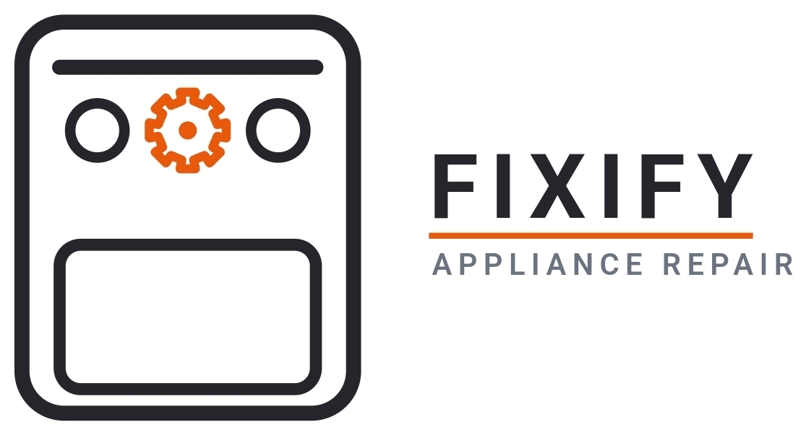
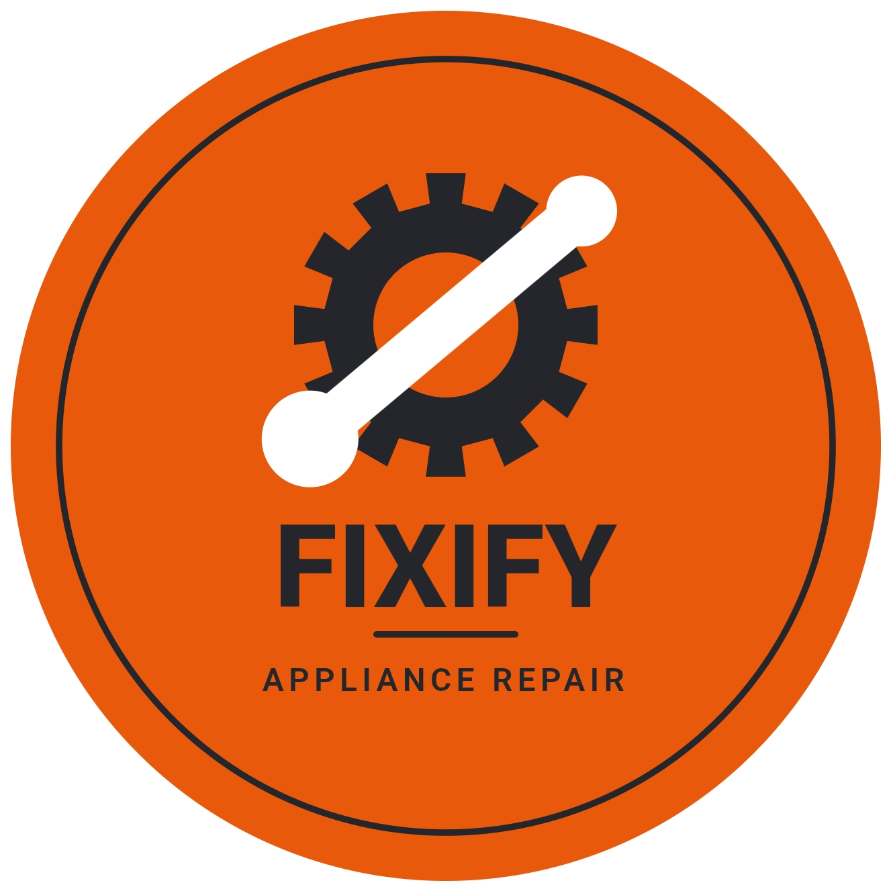
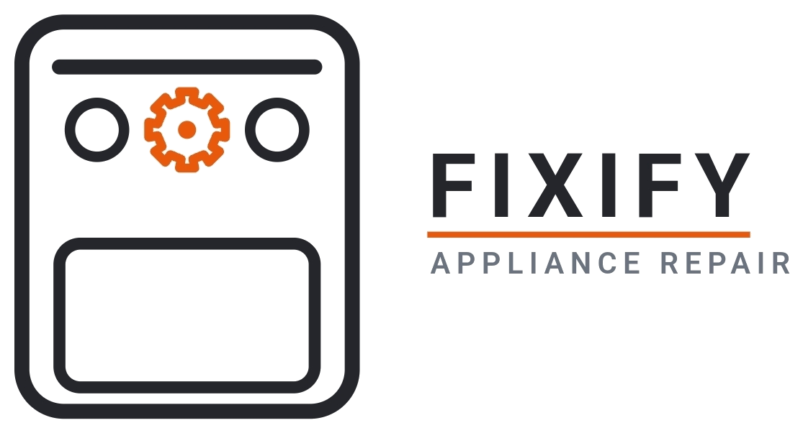

<!DOCTYPE html>
<html lang="en">
<head>
<meta charset="UTF-8">
<meta name="viewport" content="width=device-width, initial-scale=1.0">
<title>Fixify Appliance Repair | Newburgh, Chandler &amp; Evansville, IN</title>
<meta name="description" content="Fixify Appliance Repair fixes refrigerators, washers, dryers, dishwashers, ovens and more across Newburgh, Chandler, and Evansville, Indiana. Flat $100 diagnosis, clear communication, on-time arrival, spotless cleanup.">
<link rel="icon" type="image/png" href="assets/fixify-badge.png">
<link rel="preconnect" href="https://fonts.googleapis.com">
<link rel="preconnect" href="https://fonts.gstatic.com" crossorigin>
<link href="https://fonts.googleapis.com/css2?family=Oswald:wght@500;600;700&family=Inter:wght@400;500;600;700&display=swap" rel="stylesheet">

</head>
<body>

<header class="site-header">
  

    <nav class="nav">
      
      <ul class="nav-links">
        <li><a href="#services">Services</a></li>
        <li><a href="#pricing">Pricing</a></li>
        <li><a href="#areas">Areas We Serve</a></li>
        <li><a href="#contact">Contact</a></li>
      </ul>
      

        <a class="nav-phone" href="tel:+12704850836">(270) 485-0836</a>
        <button class="nav-toggle" id="nav-toggle" aria-label="Open menu" aria-expanded="false" aria-controls="mobile-menu">
          <svg viewBox="0 0 24 24" fill="none" stroke="currentColor" stroke-width="2" stroke-linecap="round"><line x1="3" y1="6" x2="21" y2="6"/><line x1="3" y1="12" x2="21" y2="12"/><line x1="3" y1="18" x2="21" y2="18"/></svg>
        </button>
      

    </nav>
    

      <a href="#services">Services</a>
      <a href="#pricing">Pricing</a>
      <a href="#areas">Areas We Serve</a>
      <a href="#contact">Contact</a>
      <a class="btn btn-primary btn-block" href="tel:+12704850836">Call (270) 485-0836</a>
    

  

</header>

<main id="top">

  <!-- HERO -->
  <section class="hero">
    

      

        
          <svg viewBox="0 0 24 24" fill="none" stroke="currentColor" stroke-width="2" stroke-linecap="round" stroke-linejoin="round"><path d="M12 21s-7-6.1-7-11.5A7 7 0 0 1 19 9.5C19 14.9 12 21 12 21z"/><circle cx="12" cy="9.5" r="2.4"/></svg>
          Serving Newburgh, Chandler &amp; Evansville, IN
        
        <h1>Appliance repair without the runaround.</h1>
        
Fixify keeps your refrigerator, washer, dryer, and other major appliances running — with straight answers from the first call to the final wipe-down, and a flat $100 diagnosis that goes straight toward your repair.

        

          <a href="tel:+12704850836" class="btn btn-primary">Call (270) 485-0836</a>
          <a href="#pricing" class="btn btn-ghost">See how pricing works</a>
        

      

      

        
      

    

  </section>

  <!-- TRUST -->
  <section class="trust">
    

      

        

          <svg viewBox="0 0 24 24" fill="none" stroke="currentColor" stroke-width="2" stroke-linecap="round" stroke-linejoin="round"><path d="M21 15a2 2 0 0 1-2 2H7l-4 4V5a2 2 0 0 1 2-2h14a2 2 0 0 1 2 2z"/></svg>
        

        

          <h3>Clear communication</h3>
          
You'll know what's wrong, what it costs, and when we're arriving — no guessing games.

        

      

      

        

          <svg viewBox="0 0 24 24" fill="none" stroke="currentColor" stroke-width="2" stroke-linecap="round" stroke-linejoin="round"><circle cx="12" cy="12" r="9"/><path d="M12 7v5l3.5 2"/></svg>
        

        

          <h3>On time, every time</h3>
          
We give you a real arrival window and show up in it, so your whole day isn't on hold.

        

      

      

        

          <svg viewBox="0 0 24 24" fill="none" stroke="currentColor" stroke-width="2" stroke-linecap="round" stroke-linejoin="round"><path d="M4 20l6-6"/><path d="M13.5 4.5c1.5-1.5 4-1.5 5.5 0s1.5 4 0 5.5L9 20l-5-5z"/><path d="M14.5 7.5l2 2"/></svg>
        

        

          <h3>Leaves it spotless</h3>
          
We clean up our work area before we leave. Your kitchen shouldn't look like a job site.

        

      

    

  </section>

  <!-- SERVICES -->
  <section class="services" id="services">
    

      

        <h2>What we repair</h2>
        
Most major appliances, most major brands — in your kitchen, laundry room, or wherever they've decided to break.

      

      

        

          <svg viewBox="0 0 48 48" fill="none" stroke="#21232A" stroke-width="2" stroke-linecap="round" stroke-linejoin="round"><rect x="12" y="4" width="24" height="40" rx="4"/><line x1="12" y1="20" x2="36" y2="20"/><circle cx="30" cy="12" r="1.6" fill="#E8590B" stroke="none"/><circle cx="30" cy="28" r="1.6" fill="#E8590B" stroke="none"/></svg>
          Refrigerators
        

        

          <svg viewBox="0 0 48 48" fill="none" stroke="#21232A" stroke-width="2" stroke-linecap="round" stroke-linejoin="round"><rect x="8" y="6" width="32" height="36" rx="5"/><circle cx="24" cy="26" r="9"/><circle cx="15" cy="13" r="1.6" fill="#E8590B" stroke="none"/><circle cx="22" cy="13" r="1.4"/></svg>
          Washers
        

        

          <svg viewBox="0 0 48 48" fill="none" stroke="#21232A" stroke-width="2" stroke-linecap="round" stroke-linejoin="round"><rect x="8" y="6" width="32" height="36" rx="5"/><circle cx="24" cy="27" r="8"/><path d="M20 24a4 4 0 0 0 6 5" /><circle cx="15" cy="13" r="1.6" fill="#E8590B" stroke="none"/><circle cx="22" cy="13" r="1.4"/></svg>
          Dryers
        

        

          <svg viewBox="0 0 48 48" fill="none" stroke="#21232A" stroke-width="2" stroke-linecap="round" stroke-linejoin="round"><rect x="9" y="4" width="30" height="40" rx="4"/><line x1="9" y1="14" x2="39" y2="14"/><rect x="14" y="21" width="20" height="16" rx="2"/><circle cx="33" cy="9" r="1.6" fill="#E8590B" stroke="none"/></svg>
          Dishwashers
        

        

          <svg viewBox="0 0 48 48" fill="none" stroke="#21232A" stroke-width="2" stroke-linecap="round" stroke-linejoin="round"><rect x="6" y="6" width="36" height="36" rx="4"/><rect x="11" y="20" width="26" height="16" rx="2"/><circle cx="13" cy="13" r="1.8"/><circle cx="20" cy="13" r="1.8"/><circle cx="27" cy="13" r="1.8" fill="#E8590B" stroke="none"/><circle cx="34" cy="13" r="1.8"/></svg>
          Ovens &amp; Ranges
        

        

          <svg viewBox="0 0 48 48" fill="none" stroke="#21232A" stroke-width="2" stroke-linecap="round" stroke-linejoin="round"><rect x="4" y="14" width="40" height="22" rx="4"/><circle cx="15" cy="25" r="4.5"/><circle cx="33" cy="25" r="4.5" stroke="#E8590B"/></svg>
          Cooktops
        

        

          <svg viewBox="0 0 48 48" fill="none" stroke="#21232A" stroke-width="2" stroke-linecap="round" stroke-linejoin="round"><path d="M24 4v15"/><path d="M17 12l7 7 7-7"/><rect x="9" y="24" width="30" height="16" rx="3"/><line x1="15" y1="32" x2="26" y2="32"/><circle cx="32" cy="32" r="1.6" fill="#E8590B" stroke="none"/></svg>
          Appliance Installation
        

      

      
<strong>Don't see your appliance listed?</strong> Give us a call — if it runs on electricity or gas in your kitchen or laundry room, there's a good chance we can fix it.

    

  </section>

  <!-- PRICING -->
  <section class="pricing" id="pricing">
    

      

        <h2>Simple, honest pricing</h2>
        
One flat fee to find the problem. If you move forward with the repair, it comes right off the total.

      

      

        

          
1

          

            <h3>Diagnosis — $100 flat</h3>
            
We inspect the appliance, track down the issue, and give you a straightforward repair quote before we do anything else.

          

        

        

          
2

          

            <h3>Repair — fee applied to total</h3>
            
Approve the quote and we get to work right away. Your $100 diagnosis fee is credited toward the final bill.

          

        

      

      
No repair, no pressure — if you decide not to move forward, you only ever pay the $100 diagnosis fee.

    

  </section>

  <!-- AREAS -->
  <section class="areas" id="areas">
    

      

        <h2>Proudly serving three communities</h2>
        
Local, dependable appliance repair across the tri-area.

      

      

        
          <svg viewBox="0 0 24 24" fill="none" stroke="currentColor" stroke-width="2" stroke-linecap="round" stroke-linejoin="round"><path d="M12 21s-7-6.1-7-11.5A7 7 0 0 1 19 9.5C19 14.9 12 21 12 21z"/><circle cx="12" cy="9.5" r="2.4"/></svg>
          Newburgh, IN
        
        
          <svg viewBox="0 0 24 24" fill="none" stroke="currentColor" stroke-width="2" stroke-linecap="round" stroke-linejoin="round"><path d="M12 21s-7-6.1-7-11.5A7 7 0 0 1 19 9.5C19 14.9 12 21 12 21z"/><circle cx="12" cy="9.5" r="2.4"/></svg>
          Chandler, IN
        
        
          <svg viewBox="0 0 24 24" fill="none" stroke="currentColor" stroke-width="2" stroke-linecap="round" stroke-linejoin="round"><path d="M12 21s-7-6.1-7-11.5A7 7 0 0 1 19 9.5C19 14.9 12 21 12 21z"/><circle cx="12" cy="9.5" r="2.4"/></svg>
          Evansville, IN
        
      

    

  </section>

  <!-- CTA -->
  <section class="cta" id="contact">
    

      

        <h2>Ready when your appliance isn't.</h2>
        
Call or text to get on the schedule. We'll walk you through next steps and give you a real arrival window — no runaround.

        

          

            Call or text
            <a href="tel:+12704850836">(270) 485-0836</a>
          

          

            Hours
            <strong>Mon–Fri, 9am–5pm</strong>
          

        

      

      

        <a href="tel:+12704850836" class="btn btn-primary">Call Fixify now</a>
        <a href="sms:+12704850836" class="btn btn-ghost-light">Text us instead</a>
      

    

  </section>

</main>

<footer class="site-footer">
  

    

      

        
        
Appliance repair for Newburgh, Chandler, and Evansville, Indiana — professional communication, on-time arrival, spotless cleanup.

      

      <ul class="footer-links">
        <li><a href="#services">Services</a></li>
        <li><a href="#pricing">Pricing</a></li>
        <li><a href="#areas">Areas We Serve</a></li>
        <li><a href="tel:+12704850836">(270) 485-0836</a></li>
      </ul>
    

    

      &copy; 2026 Fixify Appliance Repair. All rights reserved.
      Newburgh &middot; Chandler &middot; Evansville, IN
    

  

</footer>

</body>
</html>
